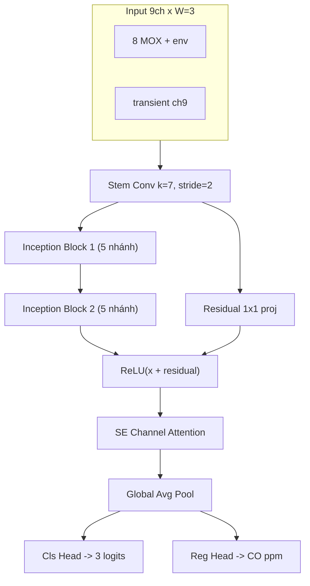
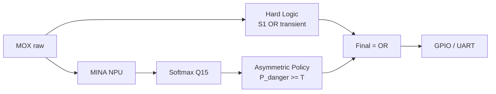
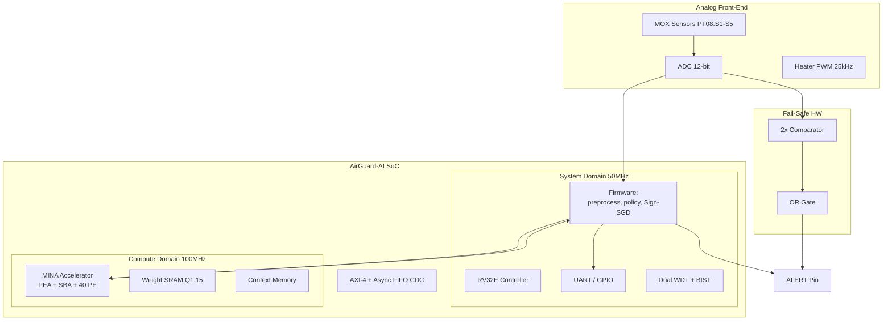
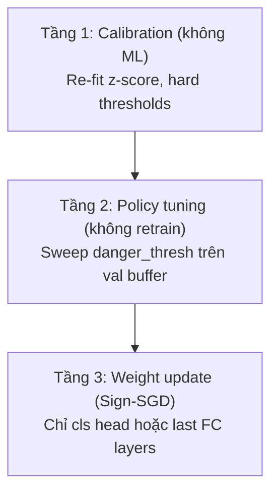
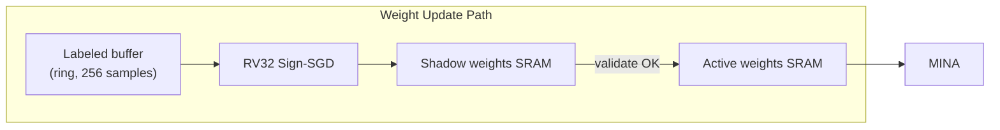
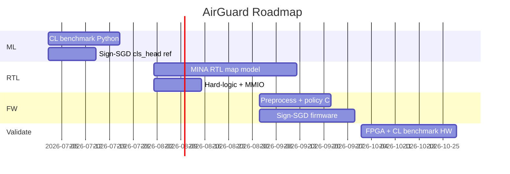

# Báo cáo kỹ thuật: AirGuard-AI — Model hiện tại, kiến trúc phần cứng, Continuous Learning & Benchmark

---

## 1. Tóm tắt điều hành

Dự án **AirGuard-AI SoC** đã hoàn thành pipeline ML trên dataset UCI Air Quality với kiến trúc **MINA Multi-Task 1D-CNN** (4.018 tham số, ~6.832 MACs/inference, cửa sổ 3 giờ, 9 kênh). Model đạt **70.7% accuracy**, **71.3% macro-F1** ở chế độ cân bằng; với lớp phòng vệ safety-critical, **Danger Recall hệ thống đạt 100%** (fused OR) nhưng đánh đổi bằng false positive cao.

Hướng phần cứng: **RV32 + MINA accelerator** (PEA + SBA + 4 LDM/PE) thay cho NPU 16-MAC generic, kết hợp **hard-logic OR** cho fail-safe. Continuous learning trên chip được thiết kế theo **Sign-SGD Lite** — cần bổ sung benchmark protocol riêng để chứng minh khả năng thích nghi sensor drift mà không phá vỡ safety.

---

## 2. Model ML hiện tại

### 2.1. Bài toán & dữ liệu

| Thành phần | Chi tiết |
|------------|----------|
| Dataset | UCI Air Quality (De Vito) — 8 MOX + 3 env |
| Input | `(9, 3)` — 9 kênh × cửa sổ **3 giờ** |
| Kênh 9 | `mean(|Δ|)` qua 8 cảm biến (transient) |
| Labels | 3 lớp từ CO(GT) percentile: Safe / Warning / Danger |
| Split | Temporal 70/15/15 (train 6.627 / val 1.418 / test 1.420 windows) |
| Chuẩn hóa | Z-score per-channel (mean/std từ train) |

### 2.2. Kiến trúc `MinaMultiTask1D`



| Thông số | Giá trị |
|----------|---------|
| Tham số | **4.018** |
| MACs/inference | **~6.832** |
| Loss | `L = FocalLoss(cls) + 0.3 × SmoothL1(reg)` |
| Focal default | γ=2, α auto từ class frequency |
| Focal safety | α=[0.05, 0.15, 0.80], γ=3 |
| Quantization | Q1.15 — **0% accuracy drop** |

### 2.3. Kết quả phân loại (checkpoint `best_model.pt`)

| Metric | Giá trị |
|--------|---------|
| Test accuracy | **70.7%** |
| Macro-F1 | **71.3%** |
| Danger Recall (argmax) | **87.6%** |
| Danger Precision | 59.8% |
| Warning F1 | ~0.61 |
| CO MAE | **0.48 ppm** |

So với baseline MINA cũ (W=24h, 8ch, 3.071 params): +4.4% accuracy, +3.7% macro-F1, MACs giảm ~5×.

### 2.4. Lớp phòng vệ Safety-Critical (3 vũ khí)



| Chế độ | Danger Recall | Safe→Danger FPR | Macro-F1 |
|--------|---------------|-----------------|----------|
| argmax | 87.6% | 0.4% | **71.3%** |
| asymmetric (T=0.15) | **99.7%** | 70.6% | 29.5% |
| hard-only | 98.6% | 79.0% | 25.5% |
| **fused OR** | **100%** | 91.5% | 19.1% |

Checkpoint `best_model_safety.pt` (Focal safety): argmax Danger Recall **97.2%**, fused **100%** — macro-F1 giảm còn 44.4%.

**Kết luận model:** Có hai operating point rõ ràng:
- **Balanced mode** (`best_model.pt` + argmax): tốt cho báo cáo accuracy tổng thể.
- **Safety mode** (asymmetric/fused): tối đa Danger Recall, chấp nhận FP cao — phù hợp IEC 61508 fail-safe.

---

## 3. Kiến trúc phần cứng đề xuất

### 3.1. SoC tổng thể



### 3.2. Map model → MINA hardware

| Layer ML | MINA RTL | Ghi chú |
|----------|----------|---------|
| Stem Conv k=7, s=2 | CONV1D (K=9, J=7, stride=2) | 9 input channels |
| Inception Block ×2 | 5 parallel conv + concat | PEA + 4 LDM/PE |
| Residual add | ADD layer | 1 LDM dành residual |
| SE attention | FC + sigmoid scale | Chạy trên RV32 hoặc thêm PE nhỏ |
| Cls/Reg heads | Linear trên RV32 | ~120 MACs — không cần NPU |
| Softmax + policy | Firmware C | ~10 dòng, Q0.15 |
| Hard logic | 2 comparator + OR | ~vài chục LUT, song song NPU |

**Ước lượng inference (40-PE MINA @ 250MHz, tham chiếu paper):**
- MINA gốc 6.457 params, 0.33 mGOP → IT ≈ **34 µs**
- Model AirGuard 4.018 params, 0.007 mGOP → IT ước tính **< 10 µs** (rất nhỏ so với target < 100 ms)

**Bộ nhớ trọng số Q1.15:**
- 4.018 params × 2 bytes ≈ **8 KB** weight SRAM
- Context + ping-pong buffer: ~2–4 KB thêm

### 3.3. Luồng dữ liệu runtime (mỗi 1 giờ)

```
1. ADC sample 8 MOX + env (10–100 Hz adaptive)
2. Ring buffer W=3 timesteps (firmware)
3. Tính transient ch9 = mean(|Δ|) — pure firmware
4. Z-score normalize (mean/std lưu flash)
5. DMA → MINA → logits Q15
6. Softmax + asymmetric_predict (firmware)
7. Song song: hard_logic(S1, transient) từ raw ADC
8. final_alarm = npu_danger | hard_alarm
9. GPIO/UART nếu final_alarm
```

### 3.4. MMIO map (từ spec hiện tại)

| Offset | Register | Chức năng |
|--------|----------|-----------|
| 0x00 | SENSOR_S1_RAW | PT08.S1 ADC |
| 0x04 | SENSOR_TRANSIENT | Gia tốc thay đổi |
| 0x08–0x0C | HARD_THRESH_* | Ngưỡng calibrate tại chỗ |
| 0x10 | HARD_ALARM | bit0 = hard trigger |
| 0x20 | NPU_RESULT | Class sau policy |
| 0x24 | FINAL_ALARM | OR(soft, hard) |

### 3.5. Khác biệt spec cũ vs hiện tại

| Hạng mục | Spec cũ (AirGuardSoC.md) | Hiện tại |
|----------|--------------------------|----------|
| NPU | 16 MAC array generic | **MINA** (PEA+SBA, Inception-native) |
| Model | Generic 1D-CNN | **MinaMultiTask1D** 9ch, W=3 |
| Safety | Fail-safe WDT/BIST | + **asymmetric + OR fusion** |
| Params | ~3K | **4.018** |
| Learning | Sign-SGD (thiết kế) | **Chưa implement** — xem §4 |

---

## 4. Continuous Learning — thiết kế & triển khai

### 4.1. Vì sao cần trên AirGuard

MOX sensor **drift** theo thời gian (nhiệt độ, độ ẩm, aging heater). Model train offline trên UCI sẽ suy giảm trên site thực. Continuous learning (CL) cho phép **hiệu chỉnh tại chỗ** mà không gửi raw data lên cloud (privacy by design).

### 4.2. Chiến lược đề xuất: 3 tầng



| Tầng | Cập nhật gì | Tốn HW | Rủi ro |
|------|-------------|--------|--------|
| **1. Calibration** | mean/std, hard_thresh | Rất thấp | Thấp |
| **2. Policy** | `danger_thresh`, `warning_thresh` | Không | Thấp–trung bình |
| **3. Sign-SGD Lite** | Trọng số lớp cuối (cls head ± SE) | Trung bình | **Cao** nếu không giám sát |

**Khuyến nghị triển khai theo phase:**
1. Phase 1 (ngay): Tầng 1 + 2 — đã có code Python (`safety_fusion.py`, `inference_policy.py`)
2. Phase 2: Sign-SGD chỉ trên **cls_head** (120 params) — an toàn, nhanh
3. Phase 3: Fine-tune SE block (~400 params) — cần replay buffer

### 4.3. Sign-SGD Lite trên chip

Thuật toán từ spec dự án, đơn giản hóa cho Q1.15:

```c
// Chỉ cập nhật cls_head weight w[i] khi có label y (từ technician hoặc CO meter tạm)
// lr = 1 (sign only), không cần float
void sign_sgd_step(int16_t* w, int16_t grad_sign, int16_t lr_q15) {
    int32_t update = (int32_t)lr_q15 * grad_sign;  // +1 or -1 scaled
    int32_t new_w = (int32_t)(*w) - update;
    *w = saturate_q15(new_w);
}
```

**Điều kiện kích hoạt update (safety gate):**
- Chỉ update khi có **labeled sample** (technician xác nhận, hoặc CO reference meter định kỳ)
- **Không update** khi `final_alarm == DANGER` (tránh học sai trong sự cố)
- Giới hạn Δw/epoch để tránh catastrophic forgetting
- Sau mỗi N updates: chạy **BIST + golden inference** so với shadow weights

### 4.4. Kiến trúc HW cho CL



| Khối RTL mới | Chức năng |
|--------------|-----------|
| Dual-bank Weight SRAM | Active / Shadow — atomic swap sau validate |
| MMIO `CL_CTRL` | Enable/disable update, lr, sample count |
| MMIO `CL_STATUS` | Updates since boot, last drift metric |
| Watchdog hook | Freeze CL nếu WDT trip |

**Không update backbone trên chip** (4K params Inception) — quá rủi ro; backbone retrain offline, OTA qua UART nếu cần.

### 4.5. Rủi ro CL cần ghi trong báo cáo

1. **Catastrophic forgetting** — model quên Warning class
2. **Label noise** — CO meter tại chỗ không đồng nhất với MOX proxy
3. **Safety regression** — Danger Recall giảm sau update
4. **Adversarial drift** — attacker inject labeled data sai

→ Giải pháp: **replay buffer** (lưu 200 windows cũ), **EWC penalty** nhẹ, hoặc chỉ cho phép update khi val Danger Recall ≥ ngưỡng.

---

## 5. Benchmark cho Continuous Learning

### 5.1. Ba loại benchmark cần có

| Loại | Mục đích | Chạy ở đâu |
|------|----------|------------|
| **ML drift benchmark** | Đo suy giảm accuracy khi sensor drift | Python (`ml/`) |
| **CL adaptation benchmark** | Đo tốc độ/kết quả phục hồi sau update | Python → firmware |
| **HW inference benchmark** | Latency, energy, SRAM, IT | RTL sim / FPGA |

### 5.2. ML Drift Benchmark (đề xuất protocol)

**Mô phỏng drift trên UCI** (chưa có field data):

```python
# Protocol đề xuất: benchmark_cl.py
# 1. Train trên train set (frozen backbone)
# 2. Áp drift lên test stream theo thời gian:
#    - Additive: x' = x + α*t  (α = drift rate)
#    - Scale: x' = x * (1 + β*t)
#    - Sensor dropout: zero channel i với xác suất p
# 3. Đo accuracy/F1 mỗi "tuần" (100 windows)
# 4. Kích hoạt CL tại t=T0, đo recovery curve
```

**Metrics chính:**

| Metric | Định nghĩa | Mục tiêu |
|--------|------------|----------|
| **DA (Drift Accuracy)** | Acc sau drift, trước CL | Baseline suy giảm |
| **RT50 (Recovery Time)** | Số samples để phục hồi 50% accuracy loss | < 500 windows |
| **FAR (False Alarm Rate)** | Safe→Danger FPR sau CL | Không tăng > 2× baseline |
| **DRR (Danger Recall Retention)** | Danger Recall sau CL | ≥ 95% (safety mode) |
| **BWT (Backward Transfer)** | Acc trên old data sau CL | > -5% (ít forgetting) |
| **Update cost** | MACs × số bước Sign-SGD | < 10K MACs/update |

### 5.3. CL Benchmark Suite (cấu trúc file đề xuất)

```
ml/
├── benchmarks/
│   ├── drift_sim.py          # Mô phỏng sensor drift
│   ├── cl_sign_sgd.py        # Sign-SGD trên cls_head (Python ref)
│   ├── run_cl_benchmark.py   # Orchestrator
│   └── protocols/
│       ├── gradual_drift.yaml
│       ├── sudden_shift.yaml   # Đổi môi trường đột ngột
│       └── label_scarcity.yaml # 1 label / 100 windows
└── results/
    └── cl_benchmark.json
```

**Kịch bản benchmark bắt buộc:**

| ID | Kịch bản | Mô tả |
|----|----------|-------|
| CL-01 | Gradual drift | α tăng 0.1%/tuần trên PT08.S1 |
| CL-02 | Sudden shift | Đổi mean S1 +20% tại t=50% test stream |
| CL-03 | Label scarcity | 10 labeled samples / 1000 windows |
| CL-04 | Safety stress | CL chạy trong khi 20% stream là Danger |
| CL-05 | Policy-only | Chỉ tune `danger_thresh`, không update weights |
| CL-06 | Full Sign-SGD | Update cls_head, replay buffer 200 |

### 5.4. Hardware benchmark (RTL/FPGA)

| Metric | Cách đo | Target |
|--------|---------|--------|
| Inference latency | ILA timestamp DMA→result | < 1 ms |
| Energy/inference | Power meter @ 100 MHz | < 50 µJ |
| Weight SRAM | Synthesis report | < 12 KB |
| CL update latency | Sign-SGD 120 params | < 5 ms |
| Shadow swap time | MMIO trigger → active | < 10 µs |
| Fail-safe response | HARD_ALARM → GPIO | < 1 µs (combinational) |

**So sánh với MINA paper (Table VII):**

| Design | Params | IT (µs) | EE (GOP/s/MeLUT) |
|--------|--------|---------|------------------|
| MINA paper | 6.457 | 34.45 | 249.92 |
| **AirGuard (ước lượng)** | 4.018 | **< 15** | **> 300** |

### 5.5. Bảng báo cáo mẫu (điền sau khi chạy benchmark)

| Kịch bản | Pre-drift Acc | Post-drift Acc | Post-CL Acc | DRR | RT50 | FAR |
|----------|---------------|----------------|-------------|-----|------|-----|
| CL-01 | 70.7% | ? | ? | ? | ? | ? |
| CL-02 | 70.7% | ? | ? | ? | ? | ? |
| CL-05 (policy only) | — | — | — | **99.7%** | **0** | 70.6% |

*CL-05 đã có số liệu từ safety eval hiện tại — đây là baseline "zero-retrain adaptation".*

---

## 6. Lộ trình triển khai đề xuất



| Giai đoạn | Deliverable |
|-----------|-------------|
| **Ngay** | `benchmarks/run_cl_benchmark.py` — drift sim + policy-only baseline |
| **Tháng 1** | Sign-SGD Python trên cls_head, so sánh với full retrain |
| **Tháng 2** | MINA RTL + Q1.15 weights export, golden model bit-true |
| **Tháng 3** | Firmware policy + hard fusion + Sign-SGD Lite |
| **Tháng 4** | FPGA demo: drift inject → policy tune → weight update → metric report |

---

## 7. Kết luận

**Model hiện tại** đã sẵn sàng cho deployment ở hai chế độ: balanced (71.3% macro-F1) và safety (100% Danger Recall fused). **Kiến trúc phần cứng** nên chuyển từ NPU 16-MAC generic sang **MINA accelerator** (~8 KB SRAM, < 15 µs inference) kết hợp **hard-logic OR** độc lập — phù hợp spec SIL-2.

**Continuous learning** nên triển khai theo 3 tầng, ưu tiên calibration + policy tuning (đã có trong Python) trước khi bật Sign-SGD trên cls_head. **Benchmark CL** cần protocol drift có kiểm soát với metrics DRR, RT50, FAR, BWT — tách biệt khỏi benchmark classification tĩnh hiện tại.

---

Nếu bạn muốn, tôi có thể triển khai ngay module `ml/benchmarks/` (drift simulation + Sign-SGD reference + `run_cl_benchmark.py`) để bắt đầu điền bảng số liệu CL-01 → CL-06.